# JSJ6 Enterprise Portfolio Management MVP

A functional, locally deployable reference implementation for connecting JSJ6 strategy and mission to demand intake, assessment, leadership decisions, portfolio delivery, projects, resources, investments, dependencies, outcomes, benefits, audit, reporting, and requirements traceability.

> **Release:** 0.8.3.1 — Linked Map Index Height Patch  
> **Deployment:** Docker Desktop / Docker Compose  
> **Web port:** `8080`  
> **Mailpit:** `8025`  
> **Authentication:** local demonstration accounts only; not production SSO, CAC, or PIV  
> **Authorization:** server-side RBAC, organization scope, sensitivity checks, and audit evidence

The application is deliberately honest about coverage. v0.8.3.1 retains the v0.8.3 executive travel-assurance and theme refinements while correcting the Linked Map Index height and internal scrolling behavior. It does not change the v0.8.0 data model or remove any prior capability.

## What is new in v0.8.3.1

- **Exact map/index alignment:** the Linked Map Index observes the rendered map canvas and matches its height across responsive layout changes.
- **Contained scrolling:** the index heading and coordinate-stewardship summary remain inside the aligned panel while the ranked location list scrolls within the available space.
- **Patch-only upgrade:** no schema migration, new runtime dependency, or source-data change.

See [Upgrade to v0.8.3.1](docs/UPGRADE_0.8.3.1.md), [Phase 2 Travel Map Plan](docs/PHASE_2_TRAVEL_MAP_PLAN.md), and [Release Notes](docs/RELEASE_NOTES.md).

## What is new in v0.8.3

- **Travel footprint and assurance in one system:** the map, ranked location index, executive summary, and click-anchored detail now behave as one coordinated component.
- **Accurate compliance encoding:** marker size communicates the selected concentration measure while a blue/amber/neutral ring communicates linked required reports, overdue required reports, and planned/no-report-due activity. Compliance is calculated only from completed, approved, report-required travel.
- **Direct map manipulation:** wheel/trackpad zoom, pointer-centered zoom, drag pan, touch pinch/pan, double-click zoom, keyboard pan/zoom, Escape dismissal, bounded movement, and automatic fit-to-filtered-data replace map-header zoom buttons.
- **Bidirectional location linkage:** marker hover/focus highlights the ranked location row; list hover/focus pulses the marker; clicking either opens the same accessible popover and source filter.
- **Credible empty and stewardship states:** the empty message cannot display over populated markers; the map surfaces missing-report exposure, unmapped spend, unmapped request count, and coordinate-stewardship detail.
- **Nine professional themes:** Light, Dusk, Black, Deep Forest, Navy Command, Charcoal + Teal, Plum Authority, Steel Executive, and Warm Stone persist in the browser while preserving semantic health colors.
- **Focused forms:** all injected “Input area” notes and styling are removed; the project control is now a concise, aligned **Blueprint Catalog** button.
- **Release quality:** schema-compatible, no new runtime dependency, Python/JavaScript syntax checks pass, and **115 automated tests pass**.

See [Upgrade to v0.8.3](docs/UPGRADE_0.8.3.md), [Phase 2 Travel Map Plan](docs/PHASE_2_TRAVEL_MAP_PLAN.md), [Release Notes](docs/RELEASE_NOTES.md), and [Demonstration Walkthrough](docs/DEMONSTRATION_WALKTHROUGH.md).

## What is new in v0.8.2

- **Complete RAID identifiers:** IDs such as `RAID-26-011` remain visible, compact, and on one line while narrative content continues to wrap.
- **Stable input guidance:** Board Governance uses one full-width guidance banner above all workflow-state forms; Travel uses one full-width banner above its filter fields.
- **Executive dashboard density:** all six KPI cards fit their content in an equal-height responsive grid, and all eight division cards use an even 4×2 desktop layout with deliberate tablet/mobile breakpoints.
- **Reliable task navigation:** focused task pages honor their semantic breadcrumbs, and the task collection path safely returns to the project board instead of emitting a 405 API response.
- **Aligned icon controls and mobile sign-out:** the role-focus control is a fixed icon button with accessible state labels; a CSRF-protected Sign out action is always available in the sidebar, including compact and mobile layouts.
- **Regional travel intelligence:** the local map adds Americas, Europe, Indo-Pacific, and Middle East & Africa lenses; cost/request/engagement/division/report marker measures; zoom and fit controls; low-zoom clusters; selected-state persistence in the URL; and an executive region summary.
- **Release quality:** no migration or new runtime dependency; **111 automated tests pass**, including seven v0.8.2 acceptance tests.

See [Upgrade to v0.8.2](docs/UPGRADE_0.8.2.md), [Release Notes](docs/RELEASE_NOTES.md), [User Guide by Role](docs/USER_GUIDE.md), and [Administrator Guide](docs/ADMIN_GUIDE.md).

## What is new in v0.8.1

- **Readable project overview:** purpose, desired end state, scope, deliverables, accountability, baseline/current dates, variance, and completion now use structured, aligned information groups.
- **Correct project signals and Gantt labels:** Governed Reporting, Schedule Assurance, and Flow Management use isolated metric-card styling; WBS number, task title, and dates no longer collapse into one text run.
- **Responsive RAID and dependencies:** panels stack when needed, tables consume available width, metadata stays on one line, narrative fields wrap, and narrow screens use record cards instead of page-level horizontal scrolling.
- **Focused governance creation:** New briefing or review opens a dedicated create-or-cancel page; permissions, CSRF protection, source-backed briefing initialization, attribution, and auditing remain enforced.
- **Stable roadmap filters:** Status, Division, Apply, and Reset use a defined responsive filter layout separated from the forecast panel.
- **Uniform configurable dashboard panels:** Compact, Standard, and Wide panel tokens now control all panels consistently with stretched row alignment and responsive stacking.
- **Dedicated Investment Flow:** Portfolio Overview now contains only Approved, Actual to Date, and Unspent Approved summary values. The complete interactive flow, reconciliation, filters, accessible category table, and source baselines live at `/financials/flow`.
- **Release quality:** no database migration or new application dependency; **104 automated tests pass**, including seven new v0.8.1 acceptance tests.

See [Upgrade to v0.8.1](docs/UPGRADE_0.8.1.md), [Release Notes](docs/RELEASE_NOTES.md), [User Guide by Role](docs/USER_GUIDE.md), and [Administrator Guide](docs/ADMIN_GUIDE.md).

## What is new in v0.8.0

- **Self-service projects:** authorized users can create a division-local project using existing capacity or a portfolio-managed project requiring enterprise funding/resources. A local project can later be promoted without changing its stable project ID or losing tasks, evidence, audit history, or relationships.
- **Focused forms:** project creation, promotion, task, milestone, RAID, status report, resource request, and resource-import review workflows use dedicated pages. Kanban task links use reliable full-page details; inline and slide-out data-entry patterns are minimized.
- **Role-focused Portfolio Overview:** Leader, Portfolio, Division, Project Manager, Contributor, Resource, Financial, and Operations lenses start with different smart panel orders. Users can reorder, resize, or hide panels and persist their configuration.
- **Direct Divisions access:** Divisions is a primary navigation destination, a topbar division switcher, a dashboard shortcut, and a breadcrumb destination. Users no longer navigate through Reports to reach Division Summary.
- **Division identity:** JFID uses the corrected banner and summary; CCD and the DDC5I Front Office are first-class division profiles with responsive banners, mission details, focus areas, responsibilities, and direct portfolio views.
- **Controlled resource exchange:** Administrators can export resources and requests, download a CSV template, preview a resource-capacity import with row-level validation, and explicitly commit audited creates/updates.
- **Expanded project blueprints:** 14 active blueprints cover division-local work, general delivery, software, AI/ML, architecture, C2 requirements, coalition interoperability, joint fires/CJADC2, cyber experimentation, policy, events, process improvement, assessments, and data standards.
- **Release quality:** migration head `0009_self_service_v080`; clean Alembic upgrade validated; Python and JavaScript syntax checks pass; **97 automated tests pass**.

See [Upgrade to v0.8.0](docs/UPGRADE_0.8.0.md), [Release Notes](docs/RELEASE_NOTES.md), [User Guide by Role](docs/USER_GUIDE.md), and [Administrator Guide](docs/ADMIN_GUIDE.md).

## What is new in v0.7.9

- **Simplified navigation:** a normal role now sees nine primary destinations (Home, My Work, Projects, Demand Intake, Briefings, Resources, Investments & Value, Reports & Analytics, Travel & Engagements). Less-frequent workspaces (Strategy, Scenarios, Decisions, Risks & Dependencies, Roadmaps, Blueprints, Notifications, saved views) and Administration & Assurance collapse into persistent expandable sidebar groups. No authorized capability was removed. The top strip is now a contextual shortcut bar (Home, My Work with open count, your top two role actions, Notifications) instead of a duplicate of the sidebar.
- **My Work Action Center:** one prioritized queue grouped by attention level — Critical now, Awaiting me, Due soon, Needs update, Watching, Recently completed. Each card explains *why* it needs attention, shows parent, priority, due date, and status, and offers one primary action. Empty groups collapse automatically; a single positive empty state replaces multiple empty panels. Briefing questions, change requests, travel follow-ups, stale project status, and health deterioration all feed the same queue.
- **Quick actions:** task percent-complete and completion, and action close-out, can be performed inline from My Work in seconds — CSRF-protected, permission-checked (owner or managing PM), and fully audited with before/after evidence (`QUICK_UPDATE`, `QUICK_CLOSE`).
- **Decision-first Portfolio Overview:** the executive dashboard now leads with **Decisions Required** and **Significant Changes** (health deterioration, critical risks, cost-forecast breach, milestone slippage, stale status) before KPIs and health. The Investment Flow Sankey moved into a dedicated **Investment analysis** deep-dive section below the decision surface.
- **Explainable rollups:** Portfolio Health gained a *Why? · View calculation* control showing the formula, per-status counts, the effective-health precedence (override → owner → calculated) per contributing project, and data freshness.
- **Travel decomposed into focused workspaces:** Overview (KPIs, map, trends, compliance, outcome pipeline), Requests, Trip Reports, Reconciliation, and Engagement Outcomes — with server-side pagination (25 rows per page) replacing single very long pages, filters preserved across views, and a shorter viewport-friendly map with an independently scrolling location index.
- **Adaptive guidance and onboarding:** the role-focus strip compacts automatically for returning users (and can be toggled), page guides collapse by default after first visit, and a role-specific *Getting started* checklist appears on first login with dismiss and restart controls.
- **Help & glossary drawer:** a searchable drawer (topbar **?**) defining RAID, ROM, RTM, health status, calculated vs approved status, benefit realization, ROI, authoritative source, reconciliation, determination, stage gate, and confidence score — each with plain-language meaning, why it matters, owner, authoritative source, and location.
- **Adoption measurement hooks:** a privacy-conscious local telemetry queue (`window.jsj6Telemetry`) records UX events (page views, quick actions, help usage, glossary and search misses) in a 200-event local ring buffer with no network calls, no identifiers, and no record content — ready for the organization to connect approved analytics tooling later.
- **Accessibility and mobile:** global `prefers-reduced-motion` support, 42px minimum touch targets on mobile, Action Center cards reflow to stacked mobile layout, and the help drawer is full-screen on small viewports.
- **Release integrity:** the `VERSION` file is now the single source of truth (`app.config.APP_VERSION`) feeding the FastAPI metadata, UI footer, static asset strings, export schema versions, and package README — resolving the v0.7.7/v0.7.8 drift. Nine stale test expectations were root-caused and intentionally updated; the suite now contains **89 passing tests** including nine new v0.7.9 acceptance tests.

## What is new in v0.7.8

- **Portfolio Overview layout:** the Portfolio planning flow (Investment Flow Sankey) now occupies its own full-width row with a wider diagram; Portfolio Health, My Tasks, and Recent Decisions sit below it in a dedicated three-panel row, in that order.
- **Realistic travel geography:** the Interactive geographic footprint now renders a locally packaged equirectangular world map with true country landmasses (279 simplified Natural Earth rings, ~72 KB, inline SVG) styled for both light and dark themes. No external tiles, fonts, or services; the air-gap posture is unchanged and existing marker coordinates project identically.
- **Tighter map panels:** the geographic footprint and Linked map index cards are shorter; the map canvas holds a true 2:1 aspect, and the Top Locations index now lists up to 25 destinations in a scrollable list.
- **Outcome pipeline:** the Travel-to-value chain funnel is replaced by a horizontal stage-bar pipeline. Each stage shows its record count, bar length relative to starting volume, and the percentage carried over from the previous stage — a direct read of where volume drops off.
- **First-load motion:** KPI numbers count up, donut segments sweep, bars and meters grow, Sankey links draw in, and map markers pop with staggered timing. Animations run once per element on first visibility, use ~0.6–1.2 s eased curves, honor `prefers-reduced-motion`, and remove themselves after entry so hover interactions stay instant.

## What is new in v0.7.7

- Added an interactive, locally rendered travel map with proportional estimated-cost markers, linked Top Locations, mapping coverage, and visible unmapped-location stewardship.
- Added governed destination alias normalization while preserving original source values and avoiding external geocoding or map services.
- Added monthly travel cost-and-volume, determination-by-division, outcome-funnel, report-compliance, and engagement-impact visuals.
- Added a reconciled **Investment Flow** Sankey on Portfolio Overview with category, division, project, actual-to-date, and unspent-approved drill-through.
- Relabeled **Briefings & Reviews** to **Briefings** without changing routes, records, permissions, or audit history.
- Corrected the portfolio benefit KPI so nonmonetary benefit-index values are not formatted as currency.
- Added ten v0.7.7 RTM requirements and four acceptance tests; the full suite contains 89 passing tests.

See [Upgrade to v0.7.9](docs/UPGRADE_0.7.9.md), [Upgrade to v0.7.7](docs/UPGRADE_0.7.7.md), [Release Notes](docs/RELEASE_NOTES.md), [User Guide by Role](docs/USER_GUIDE.md), and [Roadmap](docs/ROADMAP.md).

## What is new in v0.7.6

- Added a **Travel & Engagements** workspace with date, division, determination, traveler, event, and location filtering; status, division, month, destination, and reconciliation summaries; and complete request/report drill-through.
- Added canonical `TravelEngagement`, `TravelRequest`, `TravelApprovalStep`, `TripReport`, `TripReportItem`, and `TravelEntityLink` entities through migration `0008_travel_engagements_v076`.
- Added controlled imports for the supplied Travel Requests and Trip Reports workbooks with validation, non-destructive preview, row-level findings, explicit commit, stable source IDs, raw source payloads, and audit evidence.
- Seeded all **385** supplied travel approval records totaling **$1,082,395.25** and all **9** supplied trip reports. One source date-sequence anomaly is retained as a governed warning rather than silently corrected.
- Added candidate matching by traveler, division, date, event, and destination; auto-linking only for high-confidence unique matches; and human reconciliation for ambiguous records.
- Added full trip-report narrative views, structured findings/recommendations/action candidates, promotion to canonical actions, risks, or decisions, and exact backlinks to the originating report.
- Added Division Portfolio and Division Briefing sections for travel, forums, external engagement outcomes, estimated costs, report gaps, review workload, and reconciliation.
- Added travel-specific My Work follow-up, global search, data-quality rules, CSV exports, division export package content, role/sensitivity enforcement, and twelve release RTM requirements.
- Preserved the dashboard source disclaimer: travel costs are approval estimates, not authoritative actual expenditures.

See [Upgrade to v0.7.6](docs/UPGRADE_0.7.6.md), [Release Notes](docs/RELEASE_NOTES.md), [User Guide by Role](docs/USER_GUIDE.md), and [Roadmap](docs/ROADMAP.md).

## What is new in v0.7.5

- Added responsive, accessible division banners for AID, C3OD2, CID, DSD, JAD, and JFID.
- Made the Division Portfolio page the canonical current and briefing view, with presentation mode and direct review-workspace access.
- Added governed Division Profiles for mission, vision, focus areas, responsibilities, initiatives, relationships, forums, doctrine, source documents, and banner metadata.
- Corrected CID to **Coalition Interoperability Division**, JFID to **Joint Fires Integration Division**, and C3OD2 to **Cyber & C2 Operational Development Division** while preserving stable codes and linked records.
- Added versioned JSON export, multi-file CSV export, and preview-before-commit JSON/CSV profile import.

## What is new in v0.7.0

- Added division-scoped briefing cycles built on the existing Portfolio Review governance record.
- Added a standard 15-section briefing structure with source-backed project, demand, milestone, RAID, dependency, workforce, investment, benefit, status-report, and prior-action evidence.
- Added section ownership, narrative preparation, readiness, submission, approval, and return-for-change controls.
- Added approved briefing snapshots that preserve exactly what leadership reviewed.
- Added presentation mode for live briefing without a separate slide deck.
- Added review questions, responses, notes, parking-lot items, governed change requests, actions, and decision follow-through.
- Added assigned review questions and change requests to My Work.
- Added migration `0006_division_briefing_v070`.

See [Upgrade to v0.7.0](docs/UPGRADE_0.7.0.md), [User Guide by Role](docs/USER_GUIDE.md), and [Roadmap](docs/ROADMAP.md).

## What is new in v0.6.1

- Added role-specific focus statements, recommended starting actions, and Focus markers in the left navigation.
- Added contextual process guides across all major workspaces so users can understand what to do next.
- Added Standard, Large, and Extra large text preferences plus Comfortable and Compact spacing.
- Marked substantial editable forms as input areas with instructions and required-field cues.
- Rebuilt My Work as a personal workbench with direct task/action links, due dates, priorities, progress, health, and next actions.
- Increased the smallest interface text, focus visibility, control size, and keyboard orientation.

See [UX Navigation, Role Focus, and Accessibility Review](docs/UX_NAVIGATION_ACCESSIBILITY_REVIEW.md) and [Upgrade to v0.6.1](docs/UPGRADE_0.6.1.md).

## What is new in v0.6.0

- Rebranded the application shell as **JSJ6 Enterprise Portfolio Management**.
- Rebuilt the dashboard around six portfolio KPIs, portfolio-health and investment-category visualizations, recent decisions, assigned work, and a drill-down portfolio table.
- Made the premium high-contrast dark interface the default and retained a purpose-built light theme using the same component geometry and hierarchy.
- Added the requested top navigation and reorganized the left navigation into Portfolio, Quick Access, and Administration sections.
- Standardized buttons, form fields, filter bars, action groups, cards, tables, drawers, and responsive breakpoints to correct alignment and clipping across the application.
- Removed the legacy War Room route, template, navigation entry, and current-user workflow. Leadership decisions, approved status reports, risks, scenarios, and portfolio reviews remain available through their authoritative workspaces.

## What is new in v0.5.0

### User, role, scope, and delegation administration

- Administrators can create, update, activate, and deactivate local users; assign multiple roles, division scope, and sensitive-record access; and prevent self-deactivation of the active administrator account.
- Acting-role delegations retain delegator, delegate, role set, organization scope, effective period, rationale, status, creator, and audit evidence. The v0.5.0 registry is operational; automatic use of delegated roles in every authorization decision remains a documented hardening item.
- Administration presents the current organization, user, role, delegation, runtime, and configuration state in one workspace.

### Portfolio review and decision forum

- Portfolio owners and division leadership can create review periods, select scope, assign chair and participants, build agenda/recommendation items, capture rationale, and complete the forum.
- Deciding a review item creates linked authoritative Decision and Action records so meeting outcomes return to the operational registers rather than remaining isolated notes.
- Review access honors enterprise versus division scope and links from governance items back to portfolio evidence.

### Integration registry, ownership, and ProjectOS dry-run

- Administrators and data stewards can register ProjectOS, Microsoft 365, SharePoint, or other adapter endpoints, record mode/authentication metadata, run configuration health checks, and inspect synchronization history.
- Field ownership rules declare the authoritative system, allowed writers, and conflict policy for each synchronized entity field.
- The ProjectOS adapter generates a canonical project/task/milestone payload and records a complete dry-run result without performing a remote write. Live authentication, network connectivity, retries, and reconciliation remain integration-dependent.

### Resource requests and financial transaction evidence

- Resource managers and authorized portfolio staff can submit role/skill/hour requests against a project and organization, record period, priority, rationale, approval/decline, approver, resolution, and audit history.
- Financial managers can append commitment, obligation, expenditure, forecast-adjustment, and related transaction evidence to project financial records with source, reference, date, notes, and stable identifiers.
- Existing capacity, allocation, budget, forecast, actual, variance, underfunding, and benefit views remain available for decision support.

### Non-destructive scenario planning

- Authorized users can define portfolio what-if scenarios, add proposed changes against allowed project, resource-capacity, and financial fields, calculate baseline-versus-scenario metrics, approve the scenario, and apply it through a separate governed action.
- Draft and calculated scenarios never modify live records. Application requires approval before apply and records before/after audit evidence for every applied change.
- v0.5.0 provides deterministic comparison for the supported fields; dependency propagation, schedule simulation, and optimization remain roadmap capabilities.

### Data-quality and operations command centers

- Data stewards can run deterministic quality scans, assign issue owners and due dates, record dispositions, resolve issues, and drill back to supported source records.
- Current rules identify stale/missing status, alignment, ownership, schedule, dependency, and related portfolio-control conditions from authoritative records.
- Operations can generate source-grounded report packs, review section metrics and narrative, approve packs, and inspect job history. Jobs are persisted as operational evidence; an external durable scheduler/worker is not yet included.

### v0.5.0 validation

- **57 automated tests passed** with **83% application-code coverage**.
- All **44 Jinja templates** compiled, authenticated HTTP smoke checks passed for the new workspaces, and Python/JavaScript static validation completed.
- A clean migration and an in-place v0.4.0-to-v0.5.0 migration preserved 25 users, 20 demands, 17 projects, 80 tasks, and all 307 RTM rows.
- Seed data adds one portfolio review, one resource request, one financial transaction, one scenario, three integration connections, field-ownership rules, one report pack, and job-history evidence.
- Docker Compose could not be launched in the artifact environment because the Docker daemon is unavailable; target-host container validation remains required and documented.

## What is new in v0.4.0

### Execution management and schedule assurance

- Configurable project Kanban columns with persistent ordering, entry/exit criteria, archive controls, and server-enforced WIP limits.
- Hierarchical WBS numbering, parent tasks, task types, baseline dates, actual dates, custom fields, contributors, watchers, and audited sequence/indent actions.
- Dependency validation rejects circular finish-to-start chains. A transparent basic critical-path calculation and baseline-aware Gantt view support schedule review.
- Project roadmaps plot accessible work across the portfolio horizon with health and record drill-down.

### Task documents and evidence

- Version-controlled task attachments preserve logical file identity, version number, current/superseded state, SHA-256 evidence, download count, category, sensitivity, and uploader.
- PDF, PNG, JPEG, Markdown, text, CSV, and JSON support safe in-browser preview. Office documents remain secure downloads.
- File removal is soft deletion with authorized restoration; history remains visible and auditable.
- Working-note revisions retain author, timestamp, complete note snapshot, and change summary.

### Reusable delivery blueprints

- Seeded General Project, Joint Assessment Event, and Data/Standards Initiative blueprints create a complete project, board, WBS, milestones, initial notes, dependencies, and traceability.
- Projects retain the immutable template code and version used to initialize them. Existing projects are never silently changed by later blueprint versions.

### Governed status reporting and executive roll-up

- Status reports support draft, update, submit, return, resubmit, approve, period/version identity, audit, and notifications.
- Approved reports become the source-grounded reporting baseline available from project status and enterprise reporting views. Decisions requested in approved reports appear in the leadership decision queue.
- Project status report pages support browser print/PDF and link back to requirement and audit evidence.

### Deployment hardening

- Exact trusted-proxy hop configuration resolves the client address without unrestricted proxy trust. This addresses reverse-proxy/rate-limit identity issues for Synology, Nginx, Traefik, and controlled tunnel deployments.
- Configurable rate limits protect login, write, and API paths and return standard limit/retry headers.
- Administration displays the non-secret effective proxy, rate-limit, public URL, and file-policy configuration.

### v0.4.0 validation

- **50 automated tests passed** with **83% application-code coverage**.
- All **37 Jinja templates**, Python modules, and JavaScript syntax validated.
- Clean migration and an in-place v0.3.1-to-v0.4.0 migration preserved 17 projects, 80 tasks, and 20 demands.
- Clean seed includes 85 board columns, three versioned project blueprints, eight approved demonstration status reports, all 307 source RTM records, six v0.7.5 requirements, and twelve v0.7.6 travel requirements.
- Docker Compose could not be launched in the artifact environment because the Docker CLI/daemon is unavailable; target-host validation remains required and documented.

## What is new in v0.3.1

### Task detail reliability

- Kanban and WBS task controls are now real links to a shareable full task page, not button-only JavaScript actions.
- When JavaScript is available, the same links open the right-side task drawer and load the detailed workspace.
- When JavaScript is stale, blocked, or unavailable, the browser follows the link to the full task workspace instead of doing nothing.
- Static CSS and JavaScript URLs include the application version so Docker upgrades do not silently reuse an older browser bundle.
- Drawer failures now provide a direct **Open Full Task Page** recovery action.

### Governed submitted-demand editing

- A requester or sponsor can edit a **Submitted** demand before assessment begins.
- Requesters can also correct **Clarification Required** records and resubmit them.
- PMO, Division Portfolio Manager, Enterprise Portfolio Owner, and Administrator roles can edit eligible Triage records.
- Every save uses an optimistic version check, requires a change summary, increments the demand version, creates a revision record and audit event, and notifies accountable users.
- Assessment, recommendation, decision, approved, and execution-stage demands remain locked against direct editing to preserve the evaluated and approved baseline.

### Validation

- 41 automated tests pass, including task drawer/full-page fallback, versioned static assets, requester editing of submitted demand records, revision/audit evidence, and late-stage edit locking.
- No database schema change is required; migration `0003_v031_reliability_hotfix` updates RTM evidence for existing installations.

## What is new in v0.3.0

### Project task workspace

- Project task cards and WBS rows open a right-side **Task Workspace** without losing project context.
- Task detail now persists description and acceptance criteria, priority, owner, contributors, dates, baseline due date, estimated and actual effort, percent complete, tags, working notes, and acceptance evidence.
- Checklists can be created, completed, reopened, and removed.
- Task-to-task relationships support finish-to-start, start-to-start, finish-to-finish, and related links.
- Comments support `@username` mentions and generate in-app notifications.
- Task changes, comments, files, checklist activity, assignments, and WBS actions are audit recorded.

### Secure task files and evidence

- Authorized users can upload and download PDF, DOCX, XLSX, PPTX, CSV, TXT, Markdown, JSON, PNG, JPG, and JPEG files.
- File handling enforces configured size limits, safe filenames, allowed extensions, lightweight binary-signature checks, SHA-256 evidence hashes, project access rules, and controlled deletion.
- Task attachments remain on the Docker storage volume and retain uploader, description, sensitivity, media type, size, and timestamp metadata.

### Search and control reliability

- Global search now covers demands, projects, tasks, task comments, milestones, RAID, dependencies, decisions, missions, core functions, organizations, and RTM requirements.
- Search results use access-aware scoping and relevance ranking, with exact identifier matches placed first.
- Type-ahead suggestions, keyboard navigation, and a functional submit control replace the nonfunctional search behavior.
- The stray visual **K** artifact was removed while retaining Command/Ctrl+K as an invisible keyboard shortcut.
- Inline JavaScript event handlers were removed so controls work under the application Content Security Policy.

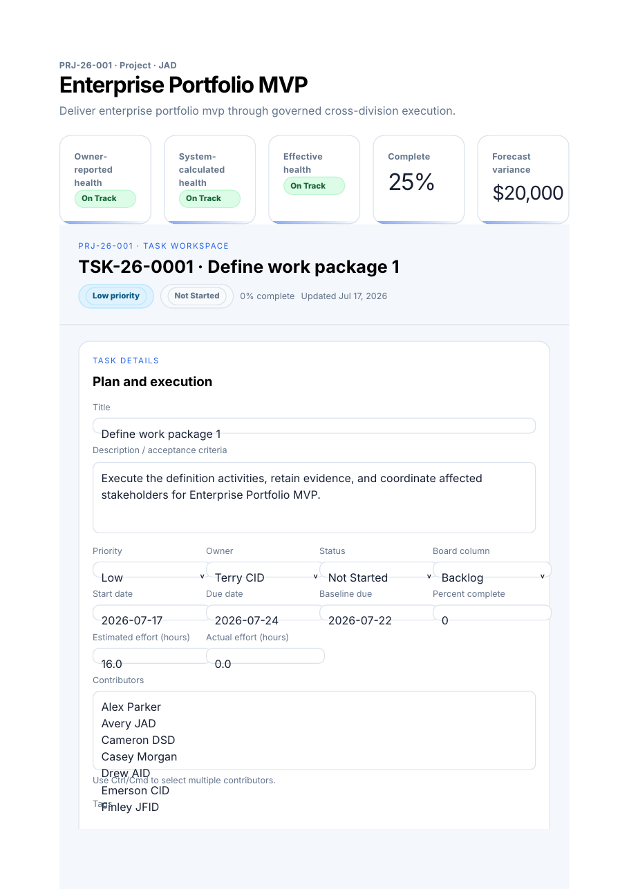

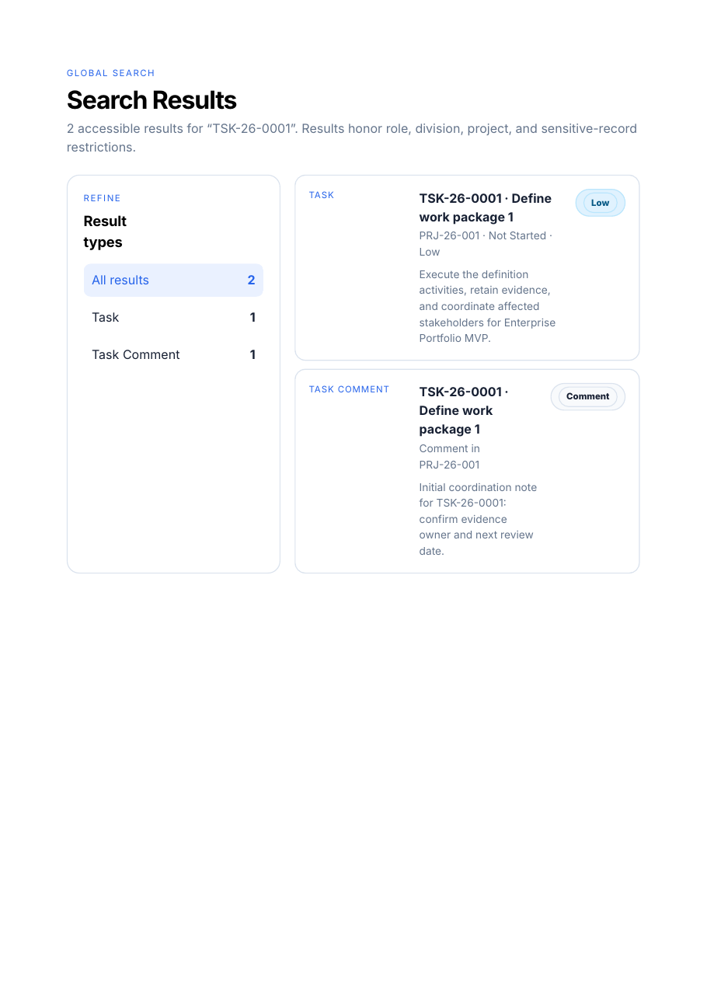

The v0.6.0 interface provides two first-class themes: **Premium Enterprise Dark** is the default and **Premium Enterprise Light** is available from the top command bar. Both use the same responsive navigation, panels, fields, tables, and drill-down behavior.

## What works on the first build

After `docker compose up -d --build`, the application automatically waits for PostgreSQL, runs Alembic migrations, seeds the demonstration environment, starts the web service, and exposes health checks.

A user can immediately:

- Sign in with documented demonstration accounts.
- Open a populated DDC5I executive dashboard and six division dashboards.
- Drill from exceptions into demand, project, milestone, RAID, dependency, owner, financial, and benefit records.
- Create and submit a demand, edit the submitted version with governed revision history before assessment, move it through triage and clarification, score it, route it through stage gates, record a decision, and convert approved work into a project without rekeying.
- Use a project workspace with overview, WBS, Kanban, milestones, RAID, dependencies, actions, financials, benefits, status updates, and a detailed task drawer/full-page workspace with notes, comments, checklist, files, relationships, evidence, and audit history.
- See project status changes roll up to division and enterprise views.
- Search across all major accessible record types, use type-ahead suggestions, filter, save views, export accessible records, review notifications, and inspect material audit history.
- Upload a versioned demand workbook, preview create/update/duplicate/warning/error/permission outcomes, commit valid rows, and download a correction workbook.
- Inspect all 335 packaged RTM requirements and filter by ID, domain, phase, preliminary fit, implementation status, release, and other traceability fields.
- Create and update local demonstration users, register acting-role delegations, and inspect audit evidence.
- Conduct a portfolio review, record a governed recommendation, and create linked decision/action records.
- Generate and inspect a ProjectOS canonical dry-run payload under explicit field-ownership rules.
- Submit and decide resource requests and append financial transaction evidence.
- Build a non-destructive scenario, calculate impacts, approve it, and apply only through a separate audited action.
- Run a data-quality scan, assign findings, generate an approved report pack, and inspect persistent job history.
- Open Travel & Engagements, reconcile approval-source requests to post-trip reports, review complete narratives, promote accepted outcomes to canonical portfolio records, and drill through source provenance.

No visible control is intentionally decorative. Capabilities that are not usable are documented as roadmap items instead of being presented as working buttons.

## Screenshots

> **v0.6.0 screenshot note:** The package retains historical authenticated screenshots. Capture refreshed dashboard, project, demand, resource, investment, scenario, and administration views on the target Docker host for formal publication.

### Executive portfolio dashboard

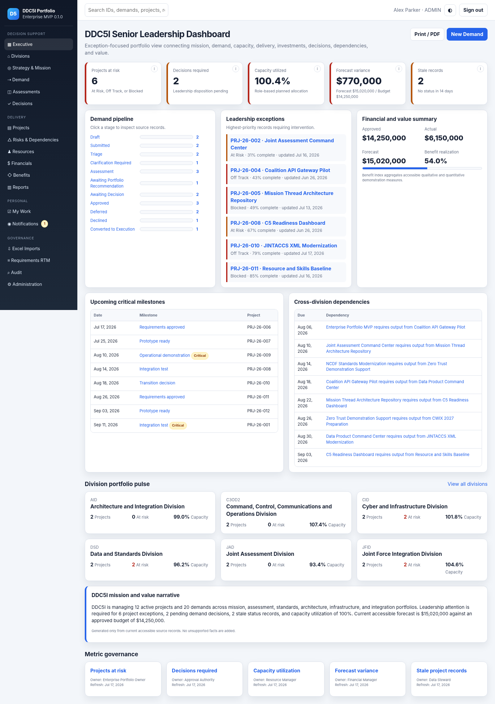

### Division dashboard

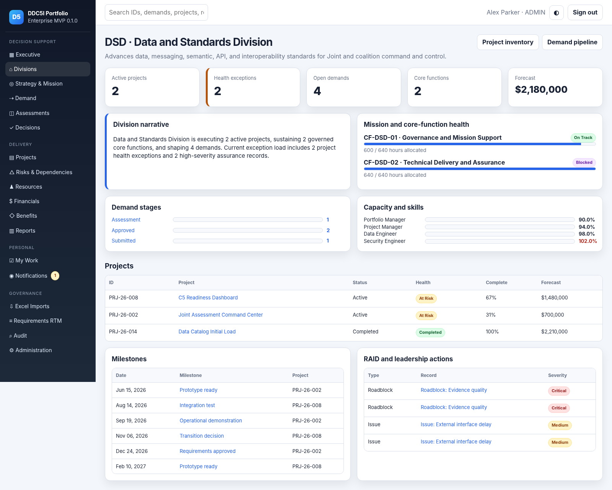

### Demand pipeline and governed intake

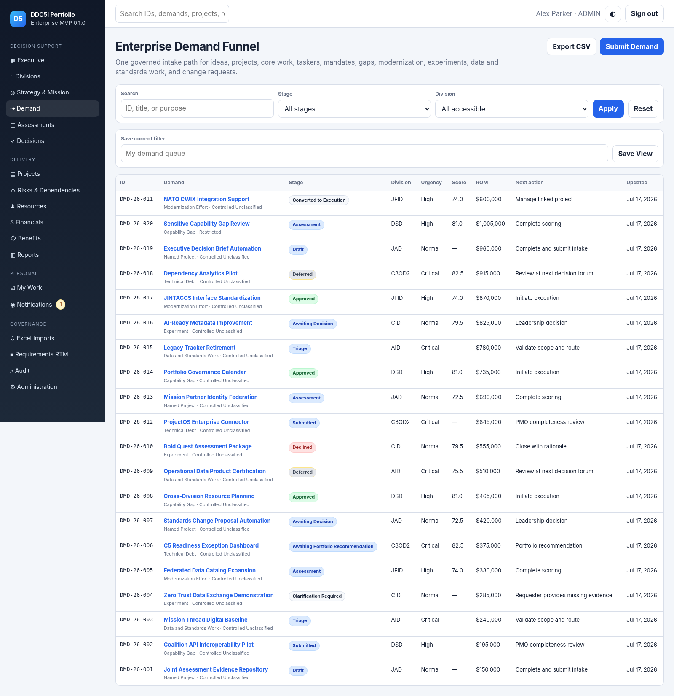

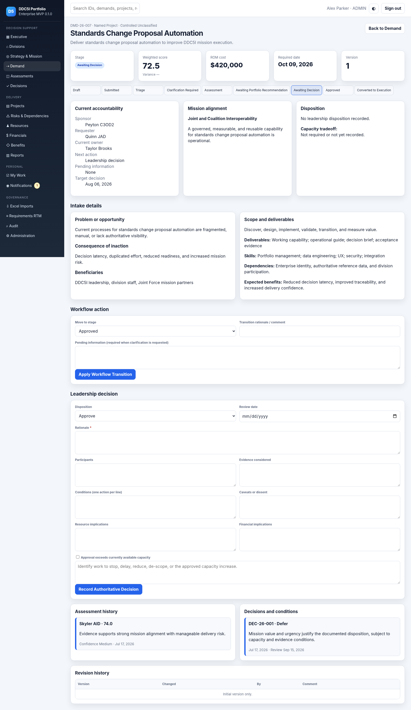

### Built-in project execution

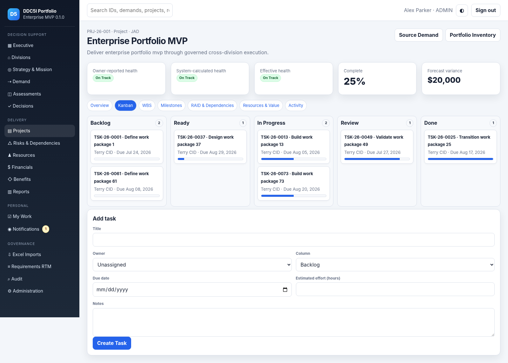


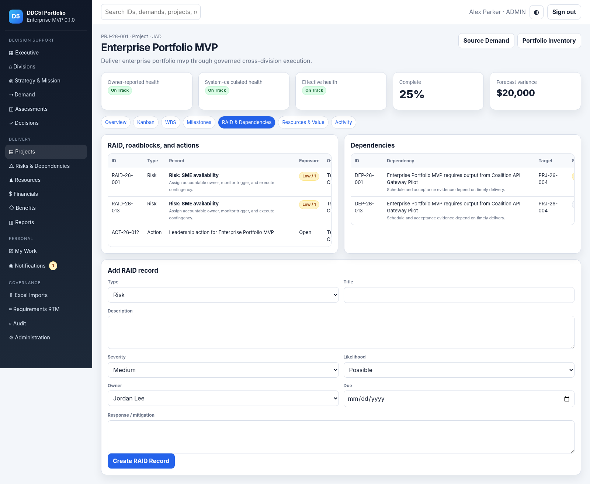

### Supporting decision data

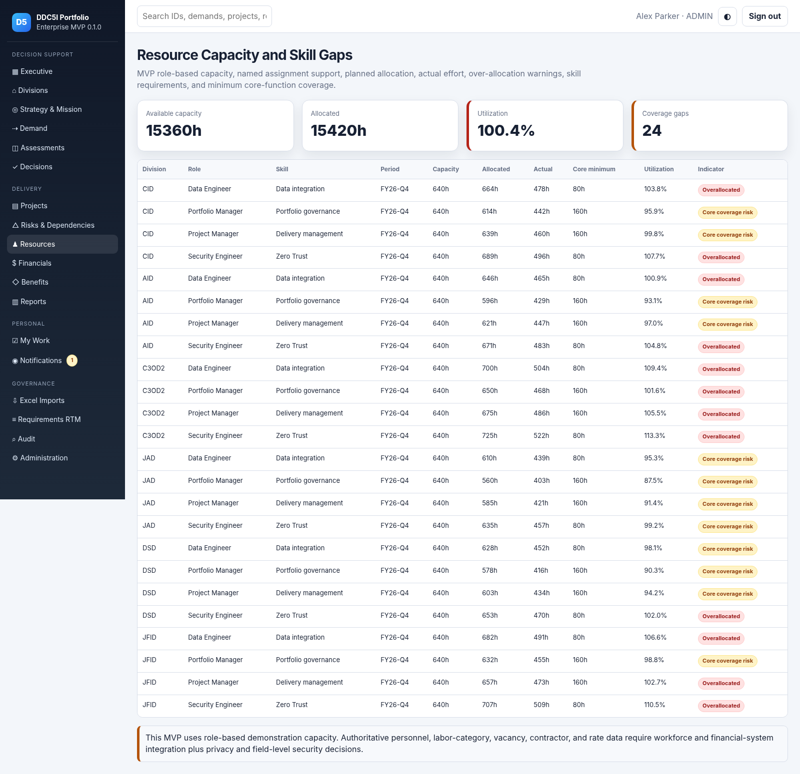

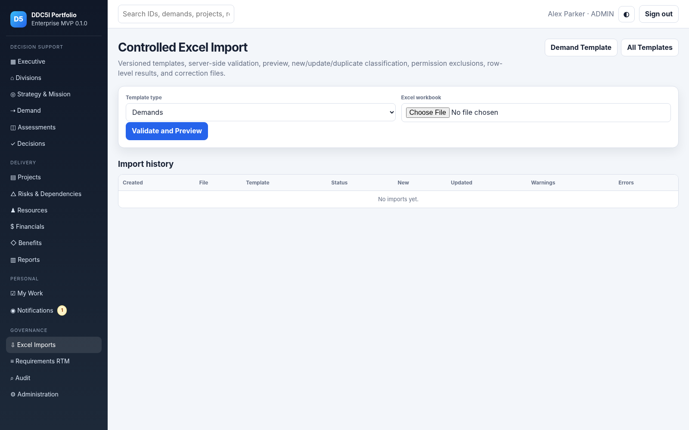

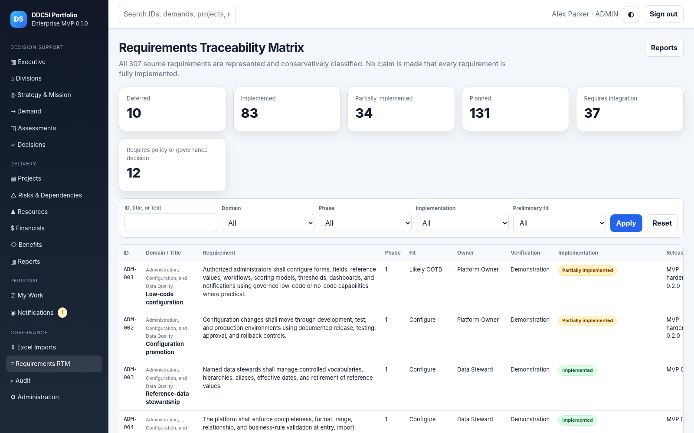


All screenshots are captured from the seeded application in this release. More images are in [`docs/screenshots`](docs/screenshots).

## Architecture

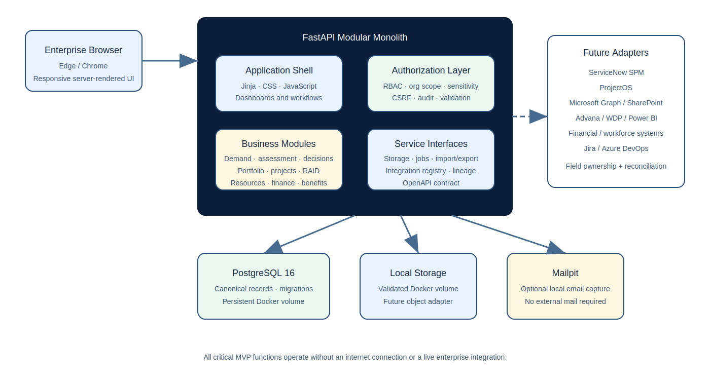

The MVP is a modular monolith using:

- FastAPI, Jinja, vanilla JavaScript, and locally bundled CSS
- SQLAlchemy and Alembic
- PostgreSQL 16
- Local Docker-volume file-storage adapter
- In-process background-job abstraction with a future durable-queue boundary
- Generated OpenAPI document exposed after authentication
- Mailpit for optional local email capture
- Adapter contracts and a field-ownership registry for future integrations

FastAPI is used instead of the preferred Next.js baseline because it preserves the required local deployment, persistent PostgreSQL data, server-side security, OpenAPI, maintainability, tests, and offline-first behavior while producing a smaller first-build footprint.

See [Architecture](docs/ARCHITECTURE.md), [Canonical Data Model](docs/DATA_MODEL.md), and [Integration Architecture](docs/INTEGRATION_ARCHITECTURE.md).

## System requirements

- Docker Desktop 4.x or Docker Engine with Docker Compose v2
- 4 GB free memory minimum; 8 GB recommended
- 3 GB free disk space for images, database volume, uploads, and backups
- Current enterprise-approved Microsoft Edge or Google Chrome
- Local ports `8080`, `8025`, and `1025` available, or changed in `.env`

No internet connection is required after the container images and Python dependencies have been obtained during the initial build. No external CDN is used at runtime.

## Install on Docker Desktop

### 1. Prepare the folder

Extract this release and open a terminal in the project root—the folder containing `docker-compose.yml`.

### 2. Create local environment settings

macOS or Linux:

```bash
cp .env.example .env
```

PowerShell:

```powershell
Copy-Item .env.example .env
```

Edit `.env` and replace `POSTGRES_PASSWORD` and `SECRET_KEY`. Generate a local secret with:

```bash
python -c "import secrets; print(secrets.token_urlsafe(48))"
```

### 3. Build and start

```bash
docker compose up -d --build
```

### 4. Confirm health

```bash
docker compose ps
curl http://localhost:8080/health/ready
```

Expected response:

```json
{"status":"ready","database":"connected"}
```

### 5. Open the application

- Application: `http://localhost:8080`
- Mailpit: `http://localhost:8025`
- Authenticated API documentation: `http://localhost:8080/api/docs`

The first startup can take several minutes because Docker builds the image, PostgreSQL initializes its volume, migrations run, and 307 requirements plus demonstration records are seeded.

## Demonstration accounts

All demonstration accounts use password `Demo123!`.

| Username | Primary role | Purpose |
|---|---|---|
| `leader` | DDC5I Senior Leader | Enterprise decision dashboard and leadership drill-down |
| `portfolio` | Enterprise Portfolio Owner | Enterprise portfolio oversight |
| `pmo` | PMO / Portfolio Manager | Intake, triage, assessment, portfolio, imports, audit |
| `approver` | Approval Authority | Leadership disposition and conditions |
| `admin` | Platform Administrator | Full local demonstration administration |
| `auditor` | Auditor | Read-only audit and governance review |
| `avery.jad` | JAD Division Chief / Portfolio Manager | Division-scoped access |
| `cameron.dsd` | DSD Division Chief / Portfolio Manager | Division-scoped access |

Additional seeded users represent assessors, project managers, team members, resource managers, financial managers, benefit owners, data stewards, and security reviewers. See Administration as `admin`.

**These credentials are development-only.** Disable local demonstration authentication and connect an approved enterprise identity provider before any operational deployment.

## Major modules

| Module | MVP behavior |
|---|---|
| Executive | Exception-oriented dashboard, decisions, milestones, dependencies, capacity, finance, benefits, stale data, narrative, and metric metadata |
| Divisions | JAD, DSD, AID, CID, JFID, and C3OD2 mission/function/portfolio drill-down |
| Strategy & Mission | Mission and core-function catalog, bidirectional alignment, unaligned-work visibility |
| Demand | Guided intake, draft/submit, organization and sensitivity scope, triage, clarification, assessment, gates, disposition, revision history |
| Assessment | Weighted 100-point model, rationale, confidence, multiple assessors, variance, side-by-side comparison |
| Decisions | Authority, participants, rationale, evidence, conditions, caveats, resource/financial implications, follow-up actions |
| Portfolios & Projects | Six division portfolios, project conversion, execution workspace, WBS controls, Kanban, task-detail drawer, notes, comments/mentions, checklist, secure task attachments, task relationships, milestones, RAID, dependencies, status |
| Resources | Role and skill capacity, allocation, actual effort, over-allocation, minimum core-function coverage |
| Financials | ROM, approved budget, actual, forecast, variance, minimum viable, full requirement, funding status |
| Benefits | Expected/realized values, owner, status, unit, and review date |
| Travel & Engagements | Approval-source requests, engagements, full trip reports, reconciliation, reviewed outcomes, portfolio promotion, provenance, division/briefing integration, and estimate-only cost labeling |
| Collaboration | In-app notifications, assignments, workflow updates, persistent task comments and @mentions, task notes/evidence, local Mailpit option |
| Import / Export | Versioned XLSX templates, demand/travel/trip-report preview and commit, correction guidance, CSV exports, and division JSON/CSV packages respecting accessible scope |
| Governance | 335-row packaged RTM, audit history, saved views, data-quality indicators, metric definitions, integration registry |

## Demonstration data

The seed tells a coherent cross-division portfolio story and reconciles dashboard totals to source records:

- 7 organizations: DDC5I Enterprise plus six divisions
- 6 division portfolios
- 6 missions and 12 recurring core functions
- 20 demands across lifecycle stages
- 17 projects: 12 active, 3 completed, 2 archived/canceled
- 80 tasks and 35 milestones
- 20 RAID records and 15 dependencies
- 10 decisions and 12 decision/roadblock actions
- 25 users with role and division assignments
- Resource capacity and skill-gap records for all divisions
- Budget, actual, forecast, funding, and benefit records
- 385 travel requests totaling $1,082,395.25 in approval estimates, 9 trip reports, reusable engagement rollups, and 102 structured report outcomes
- Multiple reporting periods, stale records, and deliberate data-quality exceptions
- Cross-division initiatives and a restricted demand
- 307 traceability records

## Key workflow walkthrough

1. Sign in as `admin` or `pmo`.
2. Open **Demand → New Demand**.
3. Complete mission alignment, problem, desired end state, division, sponsor, ROM, and benefit fields.
4. Save as draft or validate and submit.
5. Move through **Triage**, optionally **Clarification Required**, then **Assessment**.
6. Record one or more assessments using the configurable criteria shown in the UI.
7. Move through **Awaiting Portfolio Recommendation** and **Awaiting Decision**.
8. Sign in as `approver`, `leader`, or `admin`; record an authoritative disposition, evidence, conditions, and capacity tradeoff when required.
9. Convert an approved demand to a project. Approved title, mission, division, sponsor, scope, deliverables, target date, cost, benefit, and sensitivity are carried forward.
10. Update project health and progress. Return to Executive or the division dashboard to see the roll-up.

The full script is in [Demonstration Walkthrough](docs/DEMONSTRATION_WALKTHROUGH.md).

## Excel templates

- [`DDC5I_Import_Templates_v1.0.xlsx`](sample-imports/DDC5I_Import_Templates_v1.0.xlsx) — Demands, Projects, Tasks, Risks, Resources, Budgets, Benefits, and Reference Data contracts
- [`DDC5I_Demand_Import_Demo_v1.0.xlsx`](sample-imports/DDC5I_Demand_Import_Demo_v1.0.xlsx) — rows producing success, warning/possible duplicate, duplicate identifier, and validation errors

The MVP commits validated **Demand** rows. The other sheets are versioned contracts for later vertical slices and integrations; they are not falsely presented as working imports.

## Environment variables

| Variable | Default | Purpose |
|---|---:|---|
| `APP_PORT` | `8080` | Host web port |
| `POSTGRES_DB` | `ddc5i_portfolio` | PostgreSQL database |
| `POSTGRES_USER` | `ddc5i` | PostgreSQL user |
| `POSTGRES_PASSWORD` | local placeholder | Replace before startup |
| `SECRET_KEY` | local placeholder | Session and CSRF signing; replace with 32+ random characters |
| `ENVIRONMENT` | `development` | Enables secure-cookie behavior when set to `production` |
| `MAX_UPLOAD_MB` | `10` | Upload size limit |
| `MAILPIT_SMTP_PORT` | `1025` | Local SMTP capture port |
| `MAILPIT_UI_PORT` | `8025` | Mailpit web interface |

## Common operations

### Logs

```bash
docker compose logs -f web db
```

### Stop without deleting data

```bash
docker compose down
```

### Restart

```bash
docker compose up -d
```

### Data reset

This deletes the database and file-storage volumes, then reseeds the application:

```bash
docker compose down -v
docker compose up -d --build
```

### Database migrations

```bash
docker compose exec web alembic current
docker compose exec web alembic upgrade head
```

Create a new revision during development:

```bash
docker compose exec web alembic revision --autogenerate -m "describe change"
```

### Backup

```bash
./scripts/backup.sh
```

### Restore

```bash
./scripts/restore.sh backups/ddc5i-YYYYMMDD-HHMMSS.sql.gz
```

See [Backup and Restore](docs/BACKUP_RESTORE.md) before using these procedures operationally.

## Tests

Run in Docker:

```bash
docker compose run --rm web pytest -q
```

Run with coverage:

```bash
docker compose run --rm web pytest --cov=app --cov-report=term-missing
```

Validated in the release workspace: **63 tests passed**. The v0.5.0 application-code coverage baseline was 83%. Coverage includes scoring, permissions, stage transitions, database uniqueness, import validation, audit evidence, health checks, critical routes, accessible landmarks, division access denial, auditor read-only behavior, project status roll-up, the full demand-to-project workflow, the v0.6.0 dashboard, requested navigation, theme defaults, and legacy-route removal.

The build environment used to create this package did not include the Docker CLI or daemon, so the Compose stack was structurally validated but not launched here. Run the documented Docker health check on the target Docker Desktop host; this limitation is explicitly recorded in the acceptance checklist.

## Security model and production warning

Implemented in the reference MVP:

- PBKDF2-SHA256 password hashing
- Signed, HTTP-only, same-site session cookie
- CSRF verification on state-changing form and API operations
- Server-side role checks
- Division scoping and restricted-record checks
- 404 behavior for inaccessible direct-object references
- Read-only auditor behavior
- Login attempt throttling
- Content security and browser security headers
- Input and import validation
- File extension, name, path, size, SHA-256, and lightweight binary-signature controls in the storage adapter
- Material before/after audit events
- Environment-based secrets

Not implemented or authorized:

- RMF authorization or authorization to operate
- CAC/PIV, SAML, OIDC, or enterprise SSO
- DoD records schedule integration
- production-grade centralized logging/SIEM
- malware scanning, data loss prevention, or cross-domain transfer
- approved financial/personnel data connections
- formal Section 508 or WCAG 2.2 AA certification
- production high availability, disaster-recovery exercise, or 99.9% SLA evidence

See [Security and Production Hardening](docs/SECURITY_HARDENING.md).

## Integration strategy

Every future connector must define:

1. Canonical identifiers and schema version.
2. The authoritative owner of each synchronized field.
3. Allowed writers and conflict behavior.
4. Event or API contract, idempotency, retry limits, and dead-letter handling.
5. Source lineage and audit requirements.
6. Reconciliation queries, exception ownership, and operator workflow.
7. Security, privacy, records, and retention controls.

The database-backed integration and field-ownership registry prevents ambiguous ownership by design. v0.5.0 includes a ProjectOS canonical-payload dry run and persisted synchronization evidence; it does not make a live remote call. ServiceNow SPM, Microsoft Graph, SharePoint, Advana/WDP, Power BI, Jira, Azure DevOps, financial systems, workforce systems, and enterprise identity remain adapter/integration work rather than hidden MVP dependencies.

## Requirements traceability

- In-app route: **Requirements RTM**
- Machine-readable source: `app/data/requirements.json`
- Exported status report: [`docs/DDC5I_RTM_MVP_Status.csv`](docs/DDC5I_RTM_MVP_Status.csv)
- Narrative report: [Requirements Traceability](docs/REQUIREMENTS_TRACEABILITY.md)

Status is intentionally conservative. An RTM row is marked Implemented only when the reference MVP contains a usable vertical slice and a design/module reference. “Requires integration” and “Requires policy or governance decision” remain explicit.

## Roadmap

The five-phase roadmap is in [ROADMAP.md](docs/ROADMAP.md). Each roadmap work package includes business value, dependencies, related requirement IDs, complexity, primary owner, acceptance criteria, security implications, integration implications, and recommended release.

v0.8.3.1 is delivered as the Linked Map Index height patch on the v0.8.3 executive travel-assurance baseline. The next travel-map increment is defined in the [Phase 2 Travel Map Plan](docs/PHASE_2_TRAVEL_MAP_PLAN.md); the next major connected-operations release remains **0.9.0 — Connected Operations and Enterprise Identity**, centered on OIDC, enforced delegation, durable workers, a live ProjectOS test connector, reconciliation, and an approved Microsoft Graph/SharePoint pilot. AI remains gated until access control, data quality, metrics, lineage, audit, evaluation, and human-review controls are demonstrably mature.

## Documentation index

- [Target Operating Model](docs/TARGET_OPERATING_MODEL.md)
- [Installation Guide](docs/INSTALLATION.md)
- [Upgrade to v0.8.3.1](docs/UPGRADE_0.8.3.1.md)
- [Upgrade to v0.8.3](docs/UPGRADE_0.8.3.md)
- [Phase 2 Travel Map Plan](docs/PHASE_2_TRAVEL_MAP_PLAN.md)
- [Upgrade to v0.8.2](docs/UPGRADE_0.8.2.md)
- [Upgrade to v0.8.1](docs/UPGRADE_0.8.1.md)
- [Upgrade to v0.8.0](docs/UPGRADE_0.8.0.md)
- [Upgrade to v0.7.9](docs/UPGRADE_0.7.9.md)
- [Upgrade to v0.7.7](docs/UPGRADE_0.7.7.md)
- [Upgrade to v0.7.6](docs/UPGRADE_0.7.6.md)
- [Upgrade to v0.7.5](docs/UPGRADE_0.7.5.md)
- [Upgrade to v0.7.0](docs/UPGRADE_0.7.0.md)
- [Upgrade to v0.6.1](docs/UPGRADE_0.6.1.md)
- [Upgrade to v0.6.0](docs/UPGRADE_0.6.0.md)
- [Prior upgrade to v0.5.0](docs/UPGRADE_0.5.0.md)
- [Upgrade to v0.4.0](docs/UPGRADE_0.4.0.md)
- [Reverse Proxy and Rate-Limit Configuration](docs/REVERSE_PROXY.md)
- [Upgrade to v0.3.1](docs/UPGRADE_0.3.1.md)
- [Upgrade to v0.3.0](docs/UPGRADE_0.3.0.md)
- [User Guide by Role](docs/USER_GUIDE.md)
- [Administrator Guide](docs/ADMIN_GUIDE.md)
- [Architecture](docs/ARCHITECTURE.md)
- [Canonical Data Model](docs/DATA_MODEL.md)
- [Role and Permission Matrix](docs/ROLE_PERMISSION_MATRIX.md)
- [Integration Architecture](docs/INTEGRATION_ARCHITECTURE.md)
- [API Guide](docs/API.md)
- [Implementation Backlog](docs/IMPLEMENTATION_BACKLOG.md)
- [Assumptions and Open Decisions](docs/ASSUMPTIONS_DECISIONS.md)
- [Requirements Traceability](docs/REQUIREMENTS_TRACEABILITY.md)
- [Demonstration Walkthrough](docs/DEMONSTRATION_WALKTHROUGH.md)
- [Backup and Restore](docs/BACKUP_RESTORE.md)
- [Security and Production Hardening](docs/SECURITY_HARDENING.md)
- [Troubleshooting](docs/TROUBLESHOOTING.md)
- [Feature Inventory](docs/FEATURE_INVENTORY.md)
- [Known Limitations](docs/KNOWN_LIMITATIONS.md)
- [Roadmap](docs/ROADMAP.md)
- [Test Results](docs/TEST_RESULTS.md)
- [Release Notes](docs/RELEASE_NOTES.md)
- [MVP Acceptance Checklist](docs/MVP_ACCEPTANCE_CHECKLIST.md)

## License and data handling

No license was specified by the requirements artifacts. Add an approved license before external distribution. The seeded data is synthetic demonstration data and must not be interpreted as current operational DDC5I status, funding, personnel, or authoritative decisions.
