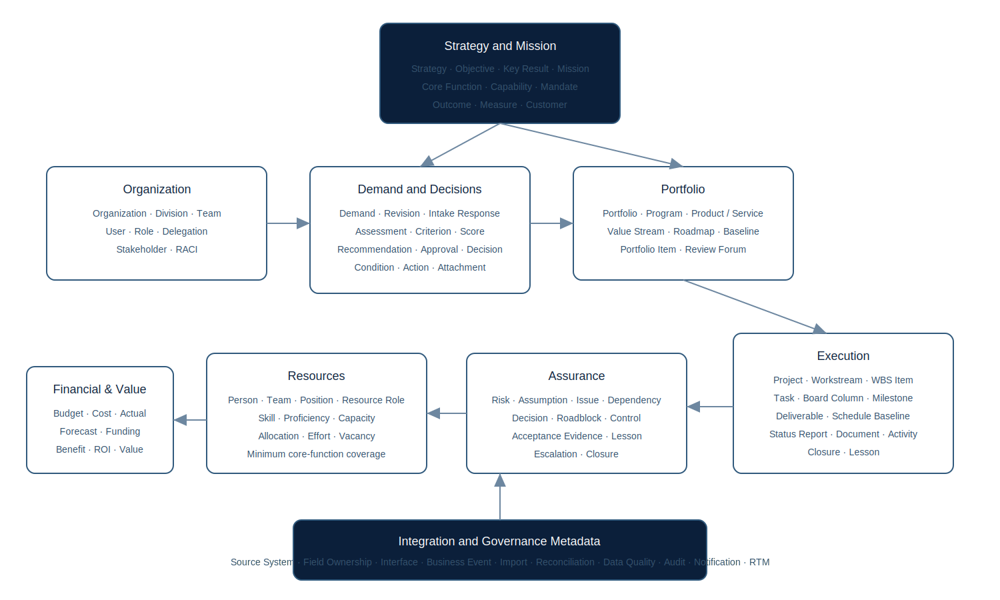

# Canonical Data Model

## Implemented relational core

The MVP schema implements the records required for the usable vertical slices:

- Organization and User
- Mission and Core Function
- Demand and Demand Revision
- Assessment
- Portfolio and Project
- Task, Task Comment, Task Attachment, Task Relationship, and Milestone
- RAID Item and Dependency
- Decision and Action
- Resource Capacity
- Financial Record and Benefit
- Notification and Audit Event
- Requirement Traceability
- Import Batch and Import Row
- Saved View and Metric Definition

All primary business records use UUIDs. Operational records also use stable human-readable identifiers such as `DMD-26-001`, `PRJ-26-001`, `TSK-26-0001`, `RAID-26-001`, `DEP-26-001`, and `DEC-26-001`.

## Metadata pattern

Implemented entities carry relevant combinations of:

- UUID primary key;
- human-readable identifier;
- created and updated timestamp;
- version/revision;
- source system and source record;
- organization, mission, sponsor, owner, or manager;
- sensitivity or access scope;
- audit before/after evidence.

The full enterprise model in the requirements includes additional normalized entities. Some are represented in the MVP as fields or JSON collections to keep the first vertical slices transactional and usable. They should be normalized when their workflows are implemented.

## Domain mapping

| Required enterprise concept | MVP representation | Next normalization |
|---|---|---|
| Strategy, objective, key result, mandate, capability, customer, outcome, measure | Mission/CoreFunction plus mission outcome and measure JSON | dedicated records and many-to-many alignment |
| Team, position, skill, proficiency, vacancy | User and ResourceCapacity role/skill rows | workforce module and authoritative connector |
| Intake responses and conditional form schema | Demand fields | configurable form/version/question tables |
| Assessment criteria and score | configured Python weights plus Assessment JSON | database-configured models and criterion versions |
| Program, product/service, value stream, roadmap, baseline | Portfolio/Project fields | portfolio taxonomy and baseline tables |
| Workstream, WBS item, board column, deliverable, schedule baseline, status report | Task/Project/Milestone fields plus TaskRelationship | full execution schema, calendars, dependency validation and baseline/version tables |
| Risk, assumption, issue, roadblock, control, evidence, lesson | polymorphic RaidItem plus Action; task acceptance evidence and TaskAttachment | normalized assurance subtypes, evidence records, repository versions and retention |
| Funding source, cost, commitment, actual, forecast, value increment, ROI | FinancialRecord and Benefit | multi-year investment ledger and benefit baseline |
| Source system, interface, event, reconciliation, data quality | service contracts and audit/import metadata | persistent integration governance tables |

## Data integrity

- UUID primary keys prevent cross-environment collision.
- human identifiers are unique.
- a demand can convert to only one project.
- foreign keys connect mission, organization, user, demand, project, and portfolio records.
- a saved-view name is unique per user.
- state transitions and field completeness are enforced at the service/route layer.
- import updates match by stable Human ID.

Production should add database-level check constraints for health/status enumerations, stronger temporal constraints, optimistic concurrency enforcement, retention markers, and immutable event identifiers.

## v0.3.0 task execution entities

### Task

In addition to the stable task ID and project foreign key, the task record includes description/acceptance criteria, priority, owner, contributor UUIDs, status, board column, sequence, indent level, start/due/baseline dates, planned/actual effort, percent complete, tags, checklist JSON, notes, and acceptance evidence.

### TaskComment

Stores the task, author, body, mention UUIDs, resolved flag, and timestamps. Mention notifications are separate Notification records so delivery state does not alter the comment.

### TaskAttachment

Stores task/project linkage, original and stored names, storage key, media type, extension, size, SHA-256, uploader, sensitivity, description, and timestamps. File bytes remain in the storage adapter rather than in PostgreSQL.

### TaskRelationship

Stores source task, target task, relationship type, creator, and timestamps. v0.3.0 prevents duplicate/self links at the route/data-integrity layer; future schedule services should add lag/lead, calendars, critical path, and invalid-relationship analysis.

## v0.5.0 canonical entities

| Domain | Entities | Purpose |
|---|---|---|
| Delegation | `Delegation` | dated acting-role and organization-scope governance evidence |
| Integration | `IntegrationConnection`, `FieldOwnershipRuleRecord`, `SyncRun` | connection metadata, authoritative ownership, dry-run/live result evidence |
| Governance forum | `PortfolioReview`, `PortfolioReviewItem` | period-based review agenda, recommendation, decision/action linkage |
| Resource | `ResourceRequest` | role/skill/hour demand, period, priority, decision and resolution |
| Financial | `FinancialTransaction` | transaction-like planning/evidence entries linked to a financial baseline |
| Scenario | `Scenario`, `ScenarioChange`, `ScenarioResult` | non-destructive proposed values, comparison metrics, approval/apply status |
| Data quality | `DataQualityIssue` | rule finding, source record, severity, owner, due date, disposition, resolution |
| Operations/reporting | `ReportPack`, `JobRun` | source-grounded report snapshot and persistent operation evidence |

All new entities use UUID primary keys. Business-facing records use stable human IDs where appropriate (`REV`, `RRQ`, `FTX`, `SCN`, `DQI`, `RPT`). Existing audit events retain actor, entity, action, timestamp, client address, and before/after evidence.
