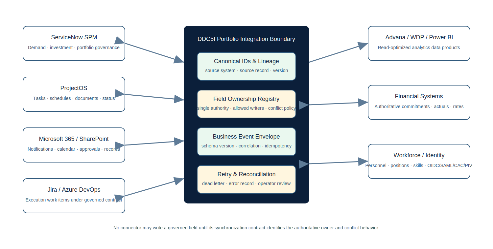

# Integration Architecture

## Principle: one authoritative writer per field

A system can be authoritative for one field and a consumer for another. A connector is not approved merely because an API exists. Before activation, every synchronized field must identify:

- authoritative system;
- allowed writers;
- direction;
- canonical and source identifiers;
- conflict policy;
- validation and transformation;
- event or polling trigger;
- retry and dead-letter behavior;
- reconciliation query and owner;
- source lineage and audit evidence;
- security, privacy, retention, and records implications.

## Adapter contract

`app/services/integrations.py` defines:

- `FieldOwnershipRule`
- `SyncEnvelope`
- `SyncResult`
- `IntegrationAdapter`
- specialized ProjectOS, ServiceNow SPM, and Microsoft Graph protocols
- an `IntegrationRegistry` that rejects conflicting ownership definitions and unauthorized writers

The default examples establish local ownership for demand status and project portfolio, governed shared ownership for task percent complete, financial-system ownership for actual cost, and workforce-system ownership for employment status.

## Synchronization envelope

The future event envelope includes event ID, event type, entity type, canonical ID, source system, source record ID, occurrence time, schema version, correlation ID, and payload. Production must add idempotency storage, signature or mutual-authentication requirements, replay controls, and classification markings.

## ProjectOS

Recommended initial contract:

- DDC5I-PM owns approved demand, portfolio, mission alignment, decision, and investment authorization.
- ProjectOS owns detailed execution task/status fields after project initiation when configured as the execution authority.
- project summary health may be derived from ProjectOS but an authorized DDC5I override remains a governed field.
- conflicts produce a reconciliation item; neither side silently wins.
- documents remain under an approved document/records system rather than duplicated without policy.

## ServiceNow SPM

A deployment must decide whether ServiceNow or DDC5I-PM is authoritative for demand intake, investment, portfolio status, and decision records. The MVP does not assume both may write. A practical pattern is to designate one system as the transaction authority and the other as a read/projection consumer for each field set.

## Microsoft 365 and SharePoint

- Graph email should contain minimal information and an authenticated link.
- actionable approvals must return to or cryptographically update the authoritative decision record.
- calendar synchronization requires ownership of meeting time, recurrence, and attendee responses.
- SharePoint document/list integration requires records, metadata, version, and permission decisions.

## Advana, WDP, and Power BI

Expose a governed read-optimized data product rather than allowing analytics platforms to overwrite operational records. Publish data definitions, refresh time, lineage, quality flags, and access rules. Use stable canonical IDs for drill-through.

## Financial and workforce systems

Actual obligations/expenditures, rates, personnel status, positions, and authoritative skills should be inbound from their owners. Restricted fields must have field-level access and should not be copied to broad dashboards.

## Reconciliation operations

Each integration needs:

1. scheduled or event-driven comparison;
2. counts and checksums by entity/time window;
3. missing, duplicate, stale, and conflicting-field categories;
4. retry state and last error;
5. accountable operator and escalation deadline;
6. corrective action with audit history;
7. closure evidence.

The MVP includes the contract boundary, not a live enterprise connection.
